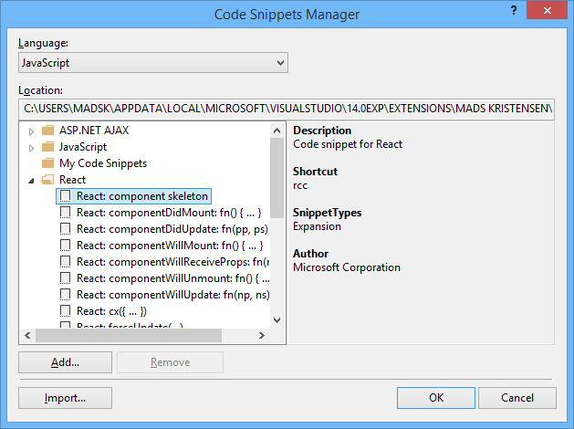

## ReactJS Snippet Pack for Visual Studio

A snippet pack to make you more productive working with React.js.

Snippets include commonly used React specific boilerplate.

The snippets match the ones found here: http://orktes.github.io/atom-react/#snippets-list

Here's the full list:

- cdm `componentDidMount: fn() { ... }`
- cdup `componentDidUpdate: fn(pp, ps) { ... }`
- cwm `componentWillMount: fn() { ... }`
- cwr `componentWillReceiveProps: fn(np) { ... }`
- cwun `componentWillUnmount: fn() { ... }`
- cwu `componentWillUpdate: fn(np, ns) { ... }`
- cx `cx({ ... })`
- fup `forceUpdate(...)`
- gdp `getDefaultProps: fn() { return {...} }`
- gis `getInitialState: fn() { return {...} }`
- ism `isMounted()`
- pt `propTypes { ... }`
- rcc `component skeleton`
- ren `render: fn() { return ... }`
- sst `setState({ ... })`
- scu `shouldComponentUpdate: fn(np, ns) { ... }`
- props `this.props.`
- state `this.state.`
- trp `transferPropsTo( ... )`
- rrc `render(component, container, [callback]) `